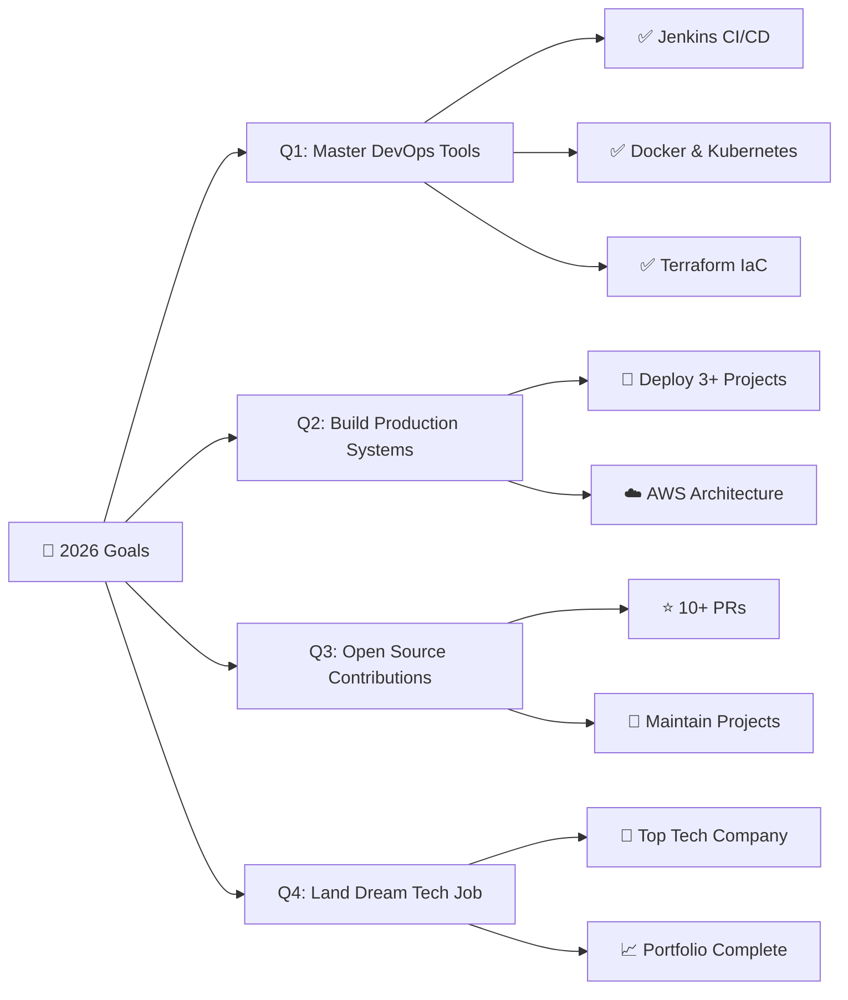

<div align="center">

<!-- ANIMATED GRADIENT HEADER BANNER -->


<!-- TYPING ANIMATION -->
<p align="center">
  
</p>

<!-- ANIMATED DEVELOPER GIF -->


<br/>

<!-- GLOWING DIVIDER -->


</div>

<br/>

<!-- HERO SECTION -->
<div align="center">

### 💫 **Designing scalable cloud systems & automating the future ☁️⚙️**


</div>

<br/>

---

<br/>

<!-- ABOUT ME SECTION -->
<div align="center">

##  **ABOUT ME**

</div>

<div align="center">

<!-- GLASSMORPHISM CARD -->
<table>
<tr>
<td>

```yaml
name: Geeta Mehra
located_in: Haldwani, Uttarakhand, India
current_role: MCA Student @ Graphic Era Hill University
education: Master of Computer Applications (MCA)
interests:
  - Cloud Computing ☁️
  - DevOps Engineering ⚙️
  - AWS & Azure Platforms 🚀
  - CI/CD Automation 🔄
  - AI Integrations 🧠
  
passion: |
  Building real-world applications that solve problems.
  Turning ideas into cloud-powered, scalable solutions.
  
mindset: Fast Learner | Problem Solver | Tech Enthusiast

currently_learning:
  - Advanced AWS Services
  - DevOps Best Practices
  - Kubernetes & Docker
  - Infrastructure as Code (Terraform)
```

</td>
</tr>
</table>


</div>

<br/>

---

<br/>

<!-- WHAT I DO SECTION -->
<div align="center">

##  **WHAT I DO**

</div>

<div align="center">

<table>
<tr>
<td width="25%" align="center">

<br/><br/>
<b>☁️ Cloud Computing</b>
<br/><br/>
<i>Building & deploying scalable<br/>cloud infrastructure on<br/>AWS & Azure</i>
</td>
<td width="25%" align="center">

<br/><br/>
<b>⚙️ DevOps</b>
<br/><br/>
<i>Automating workflows,<br/>CI/CD pipelines, and<br/>deployment processes</i>
</td>
<td width="25%" align="center">

<br/><br/>
<b>🤖 Automation</b>
<br/><br/>
<i>Streamlining operations<br/>with scripts, bots, and<br/>intelligent systems</i>
</td>
<td width="25%" align="center">

<br/><br/>
<b>🧠 AI Integration</b>
<br/><br/>
<i>Implementing AI-powered<br/>features into modern<br/>applications</i>
</td>
</tr>
</table>


</div>

<br/>

---

<br/>

<!-- TECH STACK SECTION -->
<div align="center">

##  **TECH STACK**

</div>

### **💻 Languages**
<p align="center">
  
  
  
  
  
  
</p>

### **☁️ Cloud Platforms**
<p align="center">
  
  
  
</p>

### **⚙️ DevOps & Tools**
<p align="center">
  
  
  
  
  
  
</p>

### **🎨 Design & Prototyping**
<p align="center">
  
  
  
</p>

### **📊 Data Science & AI**
<p align="center">
  
  
  
</p>

### **🚀 Frameworks & Libraries**
<p align="center">
  
  
  
</p>

<div align="center">

</div>

<br/>

---

<br/>

<!-- FEATURED PROJECT SECTION -->
<div align="center">

##  **FEATURED PROJECT**

</div>

<div align="center">

<!-- PROJECT CARD -->
<table>
<tr>
<td width="50%">

### **🌟 GramStay AI Booking Platform**


**Full-Stack Cloud Application**

🔹 **Tech Stack:** React, Node.js, Express, MongoDB  
🔹 **Features:**
- 🤖 AI-Powered Homestay Recommendations
- 📍 Village Tourism (Jim Corbett Region)
- 💳 Secure Booking System
- 🗺️ Interactive Maps & Reviews
- ☁️ Cloud-Deployed Infrastructure

**Status:** 🚧 In Development

</td>
<td width="50%">

<br/><br/><br/>

<div align="center">

```javascript
const GramStay = {
  mission: "Connect travelers with authentic 
           village experiences",
  
  technology: {
    frontend: "React + Modern UI/UX",
    backend: "Node.js + Express",
    database: "MongoDB Atlas",
    ai: "Recommendation Engine",
    cloud: "AWS (EC2, S3, RDS)"
  },
  
  impact: "Empowering rural tourism 
          & local communities",
  
  vision: "Scale to 100+ villages 
          across India"
};
```

<br/>

<a href="https://github.com/techgeeta">
  
</a>
<a href="https://github.com/techgeeta">
  
</a>
<a href="https://github.com/techgeeta">
  
</a>

</div>

</td>
</tr>
</table>


</div>

<br/>

---

<br/>

<!-- GITHUB ANALYTICS SECTION -->
<div align="center">

##  **GITHUB ANALYTICS**

</div>

<div align="center">
<div align="center">

### 📊 GitHub Insights

<a href="https://github.com/techgeeta">
  
</a>

<a href="https://github.com/techgeeta?tab=repositories">
  
</a>

<a href="https://github.com/techgeeta?tab=stars">
  
</a>

<a href="https://github.com/techgeeta?tab=followers">
  
</a>

</div>
---

<br/>

<!-- SNAKE ANIMATION -->
## 🏆 Contribution in Github
<!-- Snake Game Repo View -->

<div align="center">
  
</div>
---


---

<sub>*Watch the snake eat my contributions!* 🐍</sub>


</div>

<br/>

---

<br/>

<!-- ACHIEVEMENTS SECTION -->
<div align="center">

##  **ACHIEVEMENTS & CERTIFICATIONS**

</div>

<div align="center">

<table>
<tr>
<td align="center" width="33%">

<br/><br/>
<b>🏆 Deloitte Technology<br/>Job Simulation</b>
<br/><br/>
<sub>Completed advanced tech<br/>scenarios & case studies</sub>
</td>
<td align="center" width="33%">

<br/><br/>
<b>☁️ AWS Cloud<br/>Practitioner (Learning)</b>
<br/><br/>
<sub>Mastering AWS services<br/>& cloud architecture</sub>
</td>
<td align="center" width="33%">

<br/><br/>
<b>⚙️ DevOps Tools<br/>Expertise (Learning)</b>
<br/><br/>
<sub>Jenkins, Docker, K8s,<br/>Terraform & more</sub>
</td>
</tr>
</table>


</div>

<br/>

---

<br/>

<!-- CURRENT GOALS SECTION -->
<div align="center">

##  **2026 ROADMAP & GOALS**

</div>

<div align="center">

<table>
<tr>
<td>



</td>
</tr>
</table>

<br/>

### **🎯 Quarterly Breakdown**

| Quarter | Focus Area | Key Milestones |
|---------|-----------|----------------|
| **Q1 2026** | 🛠️ **Master DevOps Tools** | Complete AWS Solutions Architect cert, Jenkins mastery, Docker & K8s hands-on |
| **Q2 2026** | 🏗️ **Build Production Systems** | Deploy 3 full-stack apps, Implement CI/CD pipelines, Cloud architecture design |
| **Q3 2026** | 🌟 **Open Source Contributions** | Contribute to 10+ repositories, Start own OSS project, Build developer community |
| **Q4 2026** | 💼 **Secure Dream Tech Role** | Apply to top companies, Complete portfolio, Land DevOps/Cloud Engineer position |


</div>

<br/>

---

<br/>

<!-- CONNECT WITH ME SECTION -->
<div align="center">

##  **CONNECT WITH ME**

</div>

<div align="center">

<a href="https://www.linkedin.com/in/geeta-mehra-b9261a2b7/">
  
</a>
<a href="https://github.com/techgeeta">
  
</a>
<a href="mailto:geetamehra@example.com">
  
</a>

<br/><br/>


### **💬 Let's build something amazing together!**


</div>

<br/>

---

<br/>

<!-- FUN SECTION -->
<div align="center">

##  **FUN FACTS**

</div>

<div align="center">


<br/><br/>

<table>
<tr>
<td align="center">

<br/>
<b>☁️ Cloud First</b>
</td>
<td align="center">

<br/>
<b>🤖 Automate Everything</b>
</td>
<td align="center">

<br/>
<b>🚀 Ship Fast</b>
</td>
<td align="center">

<br/>
<b>📈 Scale Always</b>
</td>
</tr>
</table>


</div>

<br/>

---

<br/>

<!-- QUOTE SECTION -->
<div align="center">

##  **DEVELOPER'S MANTRA**

</div>

<div align="center">


<br/><br/>

### **💭 Personal Motto**


</div>

<br/>

---

<br/>

<!-- VISITOR COUNTER SECTION -->
<div align="center">

##  **PROFILE VIEWS**

</div>

<div align="center">


<br/>


<br/><br/>


<br/>

### ⭐ **If you like my work, consider giving a star!** ⭐


</div>

<br/>

---

<br/>

<!-- FOOTER -->
<div align="center">


<!-- GLOWING LINE -->


<br/>

**💻 Crafted with 💙 by Geeta Mehra**

<br/>


<br/><br/>

<sub>**🚀 "Turning coffee into cloud solutions, one commit at a time!"** ☕☁️</sub>

<br/><br/>

<!-- SOCIAL BADGES -->
[](https://www.linkedin.com/in/geeta-mehra-b9261a2b7/)
[](https://github.com/techgeeta)

<br/>


---

<sub>⚡ **Fun fact:** This README is also a cloud-native application! 😄</sub>

</div>
